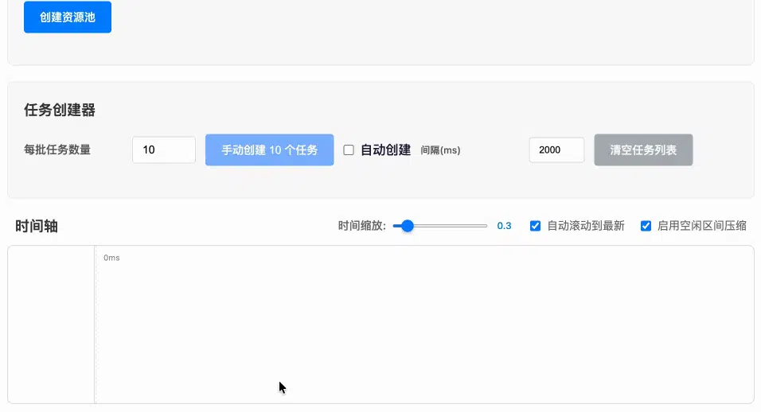

# 🏊 pool.js

[](https://www.npmjs.com/package/@cat5th/pool.js)
[](https://www.npmjs.com/package/@cat5th/pool.js)
[](https://www.npmjs.com/package/@cat5th/pool.js)
[](https://codecov.io/gh/harvey-woo/pool.js)
[](https://github.com/harvey-woo/pool.js/actions/workflows/npm-publish.yml)



一个基于资源池模式的轻量级资源调度器。
采用 ES2024 显式资源管理方案（`Symbol.dispose` / `Symbol.asyncDispose`）。

- [English README](#english)
- [在线演示](https://pooljs.cat5th.com/playground)
- [API 文档](https://pooljs.cat5th.com/docs)
- [优雅完成高频面试题《请求并发数控制》](https://juejin.cn/post/7310009007921791003)

## 特性

- [x] 🎯 显式资源管理（`Symbol.dispose`），离开作用域自动释放
- [x] 📋 任务调度器（`Scheduler`），自动分配资源
- [x] ⏱️ 冷却回调（`CoolDown`），实现速率限制
- [x] 🔧 灵活配置：工厂函数、预创建资源、自定义并发数
- [x] ⏳ 异步清理（`Symbol.asyncDispose`）
- [x] 📦 零依赖，纯 TypeScript 实现

## 安装

```bash
npm install @cat5th/pool.js
```

或 yarn

```bash
yarn add @cat5th/pool.js
```

## 快速开始

创建带并发限制的资源池：

```javascript
import { Pool } from '@cat5th/pool.js';

const pool = new Pool({
  concurrency: 3,
  create: (i) => ({ id: i })
});

// acquire() 返回 ResourceContainer
// 离开作用域时资源自动释放 (Symbol.dispose)
using resource = await pool.acquire();
console.log(resource.value.id);

// 清理整个池（等待所有借出的资源归还后再清理）
await pool[Symbol.asyncDispose]();
```

使用 Scheduler 进行任务调度：

```javascript
const pool = new Pool({
  concurrency: 2,
  create: (i) => `worker-${i}`
});

const scheduler = pool.schedule();

function work(this: string, data: string) {
  console.log(`${this} processing: ${data}`);
  return data.toUpperCase();
}

// 自动调度到可用资源
const result = await scheduler.enqueue(work, 'hello');

// 或者包装函数以便复用
const wrapped = scheduler.wrap(work);
await wrapped('world');
```

## 文档

### 创建资源池

```javascript
import { Pool } from '@cat5th/pool.js';

// 通过配置对象创建
const pool = new Pool({
  concurrency: 5,
  create: (i) => createDatabaseConnection(i),
  coolDown({ deliverAt, releaseAt }) {
    // 限制频率：确保两次使用之间至少间隔 1 秒
    return new Promise(resolve =>
      setTimeout(resolve, Math.max(0, 1000 - (releaseAt - deliverAt)))
    );
  }
});

// 通过并发数创建（资源为自动生成的数字索引）
const pool2 = new Pool(3);
// 等价于：new Pool({ concurrency: 3, create: (i) => i })

// 通过已有资源数组创建
const pool3 = new Pool([worker1, worker2, worker3]);
```

### PoolOptions 配置

| 属性 | 类型 | 默认值 | 说明 |
|---|---|---|---|
| `concurrency` | `number` | — | 最大并发数，池能管理的资源总数 |
| `create` | `(created: number) => T \| PromiseLike<T>` | `(i) => i` | 创建资源的工厂函数 |
| `resources` | `T[]` | — | 预存在的资源数组，清理池时**不会**被销毁 |
| `coolDown` | `CoolDown` | — | 资源释放后的冷却回调，控制再次可用的时间 |
| `shouldDispose` | `boolean` | `true` | 清理池时是否销毁已创建的资源 |

### acquire()

从池中获取资源，返回 `ResourceContainer<T>`。

```javascript
// 默认行为：没有可用资源时等待
const resource = await pool.acquire();

// wait: false — 没有可用资源时立即抛出 NoResourceAvailableError
try {
  using resource = await pool.acquire({ wait: false });
  // ...
} catch (error) {
  if (isNoResourceAvailableError(error)) {
    console.log('没有可用资源');
  }
}

// AbortSignal — 中断等待
const controller = new AbortController();
using resource = await pool.acquire({ abortSignal: controller.signal });
// ...
controller.abort(); // 抛出 AbortError
```

### schedule()

创建 `Scheduler`，通过任务方式执行：

```javascript
const scheduler = pool.schedule();

await scheduler.enqueue(
  function(this: Connection, query) {
    return this.query(query);
  },
  'SELECT * FROM users'
);
```

### Scheduler

`Scheduler` 提供基于任务的调度——你不需要手动获取和释放资源。

```javascript
const scheduler = pool.schedule();

// enqueue — 执行单个任务
const result = await scheduler.enqueue(workFn, arg1, arg2);

// enqueueAll — 批量执行
const results = await scheduler.enqueueAll(tasks, ...args);

// wrap — 返回自动入队的函数
const query = scheduler.wrap(function(this: Connection, sql) {
  return this.query(sql);
});
const rows = await query('SELECT * FROM users');
```

### CoolDown

回调函数接收资源调度时间信息，返回一个 Promise 来控制资源何时可以再次被分配：

```javascript
const pool = new Pool({
  concurrency: 5,
  create: (i) => createHttpClient(i),
  coolDown: async ({ acquireAt, deliverAt, releaseAt }) => {
    // 资源释放后等待 100ms 才能再次使用
    await new Promise(resolve => setTimeout(resolve, 100));
  }
});
```

### Symbol.asyncDispose

清理整个资源池——等待所有借出的资源归还后，销毁池创建的资源并重置状态：

```javascript
await pool[Symbol.asyncDispose]();
```

## 感谢

灵感来源：[pLimit](https://github.com/sindresorhus/p-limit)
